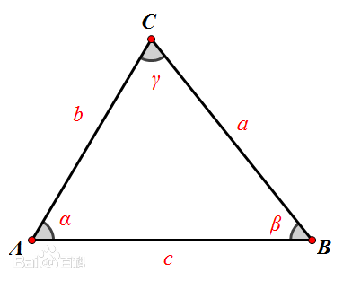
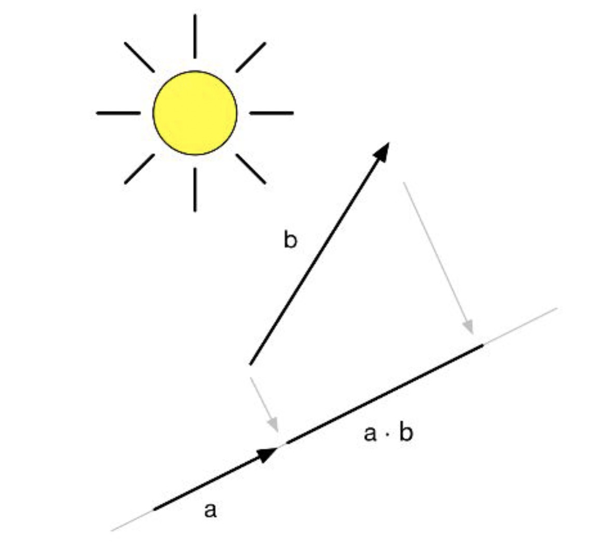
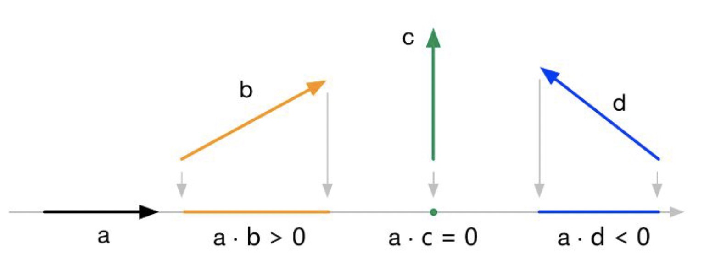

1. 余弦定理：
   对于任意三角形，任何一边的平方等于其他两边平方的和减去这两边与它们夹角的余弦的积的两倍。

$$
c^2 = a^2 + b^2 - 2ab\cos\gamma
$$
余弦定理，可以用来推导向量的点积

2. 向量的点积（点乘）公式：

$$
a\cdot b = (a_x,a_y,a_z)\cdot(b_x,b_y,b_z) = a_xb_x + a_yb_y + a_zb_z
$$

点积的几何意义为b向量在a向量方向上的投影

点积的结果是一个标量，两个向量的夹角小于90度，结果为正，等于90度，结果为0，大于90度，结果为负；可以用计算结果来判断两个向量的方向的一致性；

3. 向量的叉乘公式
   $$
   a \times\ b = (a_x, a_y, a_z) \times\ (b_x, b_y, b_z) = (a_yb_z - a_zb_y) + (a_zb_x - a_xb_z) + (a_xb_y - a_yb_x)
   $$

叉乘不满足交换律，即 a×b ≠ b×a，但满足反交换律 a×b = −(b×a)，叉乘也不满足结合律，即 (a×b) ×c ≠ a×(b×c)

原公式比较复杂，不容易记，可以用行列式的方式速记，或掐头去尾的方式速记；
$$
a \times\ b = \begin{vmatrix}i & j & k\\ a_x & a_y & a_z\\ b_x & b_y & b_z \end{vmatrix} = \begin {vmatrix} a_y & a_z \\ b_y & b_z \end{vmatrix}i + \begin {vmatrix} a_x & a_z \\ b_x & b_z \end{vmatrix}j + \begin {vmatrix} a_x & a_y \\ b_x & b_y \end{vmatrix}k
$$
计算顺序为 y -- z -- x;

《掐头去尾法》：把向量的行列式水平写两遍，再掐头去尾去掉首列和尾列，之后，从左到右交叉相乘即可，如下
$$
a \times\ b = \begin{vmatrix}a_x & a_y & a_z & a_x & a_y & a_z\\ b_x & b_y & b_z &b_x & b_y & b_z \end{vmatrix} = \begin{vmatrix}a_y & a_z & a_x & a_y\\ b_y & b_z &b_x & b_y \end{vmatrix} = \begin{vmatrix}a_y & a_z\\ b_y & b_z\end{vmatrix} + \begin{vmatrix}a_z & a_x\\ b_z &b_x \end{vmatrix} + \begin{vmatrix}a_x & a_y\\ b_x & b_y \end{vmatrix}
$$
叉乘结果是一个向量，向量的方向与做叉乘的两个向量同时垂直，也就是a、b两个向量所在平面的法线
